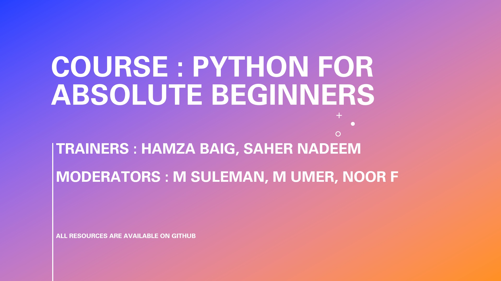

# 🔥 Python for Absolute Beginners

## ✔️ Course Information
- **Duration**: 7 April 2025 - 02 May 2025
- **Schedule**: Monday to Friday, 4 PM - 5 PM 
- **Trainers**: 
  - [Hamza Baig](https://www.linkedin.com/in/hbhamzabaig/)
  - [Saher Nadeem](https://www.linkedin.com/in/saher-nadeem-b32447213/)
- **Moderators**:
  - [Muhammad Suleman](https://www.linkedin.com/in/muhammad-suleman-z/)
  - [Muhammad Umer Awan](https://www.linkedin.com/in/mdumerdm/)
  - [Noor Fatima Memon](https://www.linkedin.com/in/noor-fatima-memon/)

## ✔️ Course Contents

## Week 1: Introduction to Programming (Computer Science Basics)

### Day 1 - Introduction to Programming Language and Importance of Python.

- 📹 [Lecture Recording](https://www.facebook.com/share/v/18uNrV4swi/)
- 💻 [Colab Notebook]()
- **Concepts Covered**:
  - Fundamentals of Programming
 

### Day 2 - Coding Softwares, Data Types, Variables.

- 📹 [Lecture Recording](https://www.facebook.com/share/v/19Z87L7NP3/)
- 💻 [Colab Notebook]()
- **Concepts Covered**:
  - IDE Setup
  - Python Basics
  - Compiler vs Interpreter
  - Data Types
  - Variables
  - Comments
  - print()
  - Identation Rules
  - Docker
  - Kubernettes

### Day 3 - Memory Allocation, Type Casting, Variable Declaration.

- 📹 [Lecture Recording](https://www.facebook.com/share/v/1D8WrvVNk8/)
- 💻 [Colab Notebook]()
- **Concepts Covered**:
  - Memory Concepts
  - Type Casting
  - Arithematic Operators
  - input()
  - Multiple Variable Declaration

### Day 4 - Logical, Boolean, Membership and Identity Operators

- 📹 [Recorded Lecture](https://www.facebook.com/share/v/1Y9gJLEkDq/)
- 💻 [Colab Notebook]()
- **Concepts Covered**:
  - Logical Operators
  - Boolean Function
  - Comparison Operators
  - Identity Operators

### Day 5 - Recap (Presentation by Participants).

- 📹 [Recorded Lecture](https://www.facebook.com/share/v/1EabojM81y/)
- 💻 [Colab Notebook]()
- **Concepts Covered**:
  - All concepts covered in whole week were presented by participants

## Week 2: Conditions and Loops
### Day 1 - Introduction to Conditions (if, elif, else) and Short-hand Conditions.

- 📹 [Recorded Lecture](https://www.facebook.com/share/v/1BDpF5c5bF/)
- 💻 [Colab Notebook]()
- **Concepts Covered**:
  - if, if else, elif Condition
  - Short-hand Conditions

### Day 2 - Logical Operators in Conditions, Nested Conditions and Pass Statement + Practice.

- 📹 [Recorded Lecture](https://www.facebook.com/share/v/1YCwfcQPY9/)
- 💻 [Colab Notebook]()
- **Concepts Covered**:
  - Logical Operators in Conditions
  - Nested Conditions in detail
  - Pass Statement
  - Programs + Practice

## 🚀 Resources
- [PEP-8 Style Guide for Python Code](https://peps.python.org/pep-0008/)

### Prerequisites
- None

### Weekly Presentation Guidelines
- Fill the sheet pinned in channel
- Present your topic and solution approach
- Code walkthrough
- Q&A session

## Getting Help
- Discuss in class for technical problems
- Use slack channel for further clarifications
- Contact moderators for administrative queries

---
